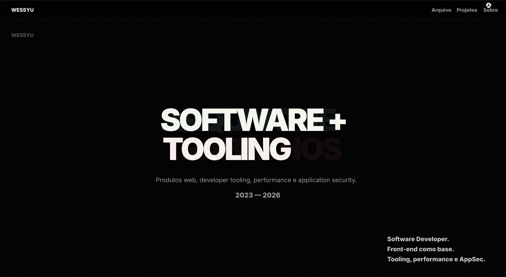

# WESSYU — ARQUIVO

<p align="center">
  
</p>

<p align="center"><strong>Portfólio editorial de produto, front-end e design com projetos apresentados como estudos de caso.</strong></p>

<p align="center"><a href="https://wessyu-arquivo.vercel.app/">Abrir portfólio</a> · <a href="https://github.com/WessYu">GitHub</a> · <a href="https://www.linkedin.com/in/wesley-santos-cruz-b57589213/">LinkedIn</a></p>

## Demo

<p align="center"></p>

## Sobre

O **WESSYU Arquivo** funciona como um arquivo de trabalhos selecionados, não como um currículo transformado em site. Cada projeto apresenta contexto, problema, decisões, implementação, aprendizados, notas técnicas e telas reais.

A experiência principal utiliza um **project reel** em tela cheia, navegação por scroll e setas e abertura de estudos de caso. O objetivo é mostrar não apenas o resultado visual, mas como cada produto foi pensado e construído.

## Projeto principal

### DevMatch

Produto full stack de recrutamento técnico com perfis separados para empresas e desenvolvedores, autenticação, vagas remotas reais da Remotive, busca, filtros, compatibilidade, matches persistidos, feed e chat contextual.

**[Ver produto](https://devmatch-neon.vercel.app)** · **[Ver código](https://github.com/WessYu/DEVMATCH)**

## Ordem dos projetos

1. **DevMatch** — recrutamento técnico, vagas reais, compatibilidade, matches e chat;
2. **Receitas** — aplicação full stack com autenticação, favoritos, moderação e painel administrativo;
3. **Logic Quest** — produto educacional com módulos, checkpoints, XP e PWA;
4. **HELENA** — experiência jurídica com formulários, protocolos e gestão interna;
5. **Differenza** — redesign com foco em hierarquia, experiência premium e agendamento;
6. **Component Vault** — experimento full stack para biblioteca e exploração de componentes.

## Stack

<p>
  
  
  
  
  
  
</p>

## Experiência

- reel de projetos em tela cheia;
- scroll snap e navegação por setas;
- cursor contextual no desktop;
- parallax leve e reveal progressivo;
- estudos de caso com problema, decisões, implementação e aprendizados;
- galeria de telas reais;
- seção de evolução e stack;
- experiência mobile própria;
- metadados Open Graph e SEO.

## Estrutura

```text
src/
├── App.tsx                    # conteúdo e estudos de caso
├── components/                # elementos reutilizáveis
├── projectReel.ts             # navegação e interações do reel
├── componentVaultSpotlight.ts # experimento complementar
├── types.ts                   # contratos dos projetos
└── *.css                      # camadas visuais e responsivas
public/
└── projects/                  # screenshots e assets dos projetos
```

## Executando localmente

```bash
git clone https://github.com/WessYu/WESSYU-ARQUIVO.git
cd WESSYU-ARQUIVO
npm install
npm run dev
```

Build de produção:

```bash
npm run build
npm run preview
```

## Próximas evoluções

- atualizar GIF e screenshots sempre que um projeto principal mudar;
- adicionar versão em inglês;
- incluir métricas de desempenho e acessibilidade dos projetos;
- melhorar navegação dos estudos de caso no mobile;
- automatizar validação de links de demonstração.

## Autor

**Wesley Cruz** — Front-End Developer & Designer  
[GitHub](https://github.com/WessYu) · [LinkedIn](https://www.linkedin.com/in/wesley-santos-cruz-b57589213/) · [E-mail](mailto:wess.c@proton.me)
